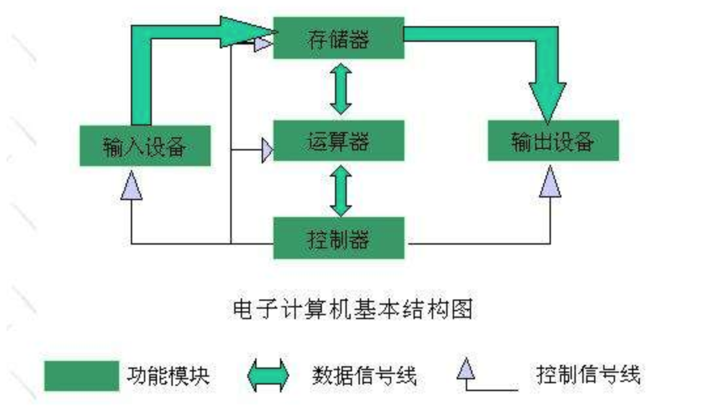
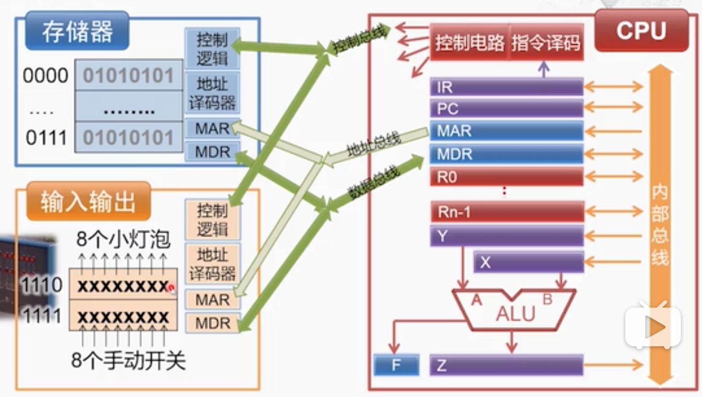

# 《计算机组成（陆俊林，北京大学）》学习笔记

## 前言

近期业余有点时间，因此就打算整体补充一下计算机基础知识，包括常见的计算机组成、汇编、编译原理、操作系统等，内容有点多，可能得慢慢的静下心来看一段时间。另外我还查了一下这一些基础知识的相互依赖关系，可以作为学习顺序的参考，如下图。

正好近期发现 bilibili 上有好多免费的名校大学的课程，录制的质量还不错（不知道是不是盗版。。。），包括本次看的计算机组成这门课，链接是 https://www.bilibili.com/video/av9647631/?p=1 。如果后期链接作废，可以根据 `计算机组成` `陆俊林` `北京大学` 这几个关键词来查找这门课的其他资源。

这门课的视频总长是 12h ，但老师讲话语速较慢，我是一个急性子，就用 1.5x 速度观看，一周时间就全部看完了。在看视频的过程中，我会随时记录下每节课的一些知识要点，而本文是最后看完的统一总结。

整个看完之后的总体感觉是：老师讲解的非常好，深入浅出，我很推荐。虽然有些地方我看不懂（毕竟这门课也不那么容易理解），但是整体上让我对计算机组成有了一个全面的认识，对我来说，不考研、不考证、纯为工作编程打基础，这就够了。

## 是什么？

**对于我等程序猿来说，这个“计算机组成”到底是什么？或者了解到什么程度就够了**？—— 这种问题算是我的个人习惯，看完学完不是终点，总得有点自己的总结和思考。

我们编写的代码最终要在计算机上运行，而运行的本质其实就是一个一个的算数或者逻辑运算。而计算机说到底是一个电子设备，计算机组成就是讲解这些算数、逻辑运算，是如何在电子设备上实现的，即讲解程序执行的最底层原理。其中主要包括：

- 计算机的主要组成部分：输入、输出、存储、控制、运算，以及他们的实现原理和依赖关系
- CPU 如何集结这些部分来完成运算

另外

- 本课程主要讲解一个抽象的理论模型，并不会涉及到电路和电子设备的知识
- 这里的“程序”就是二进制数字（也涉及少量汇编语言，而汇编语言也仅仅是二进制的助记符，如下图），高级语言转换为二进制的过程是另外其他课程的内容

## 冯.诺依曼 结构

图灵机是一个计算机的理论模型，而 冯.诺依曼 结构是图灵机的具体实现。

### 概述

冯.诺依曼 是一名数学家，还参与过原子弹的研究，被誉为“现代计算机之父”，他提出的“冯.诺依曼 结构”直到现在还被持续应用，还没有看到有其他替代产品的可能性。而“冯.诺依曼 结构”我觉得也是本课程中最最重要的一个概念，课程其中的很多细节可以不懂（作为高级语言的程序猿），但是这个结构一定要理解并且能体会到他的价值。

“冯.诺依曼 结构”最核心的几个理念（现在大家习以为常，但在当时看来可能是颠覆性的）：

- 计算机的组成部分：运算器 控制器 存储器 输入设备 输出设备
- 程序和数据一样，被计算机存储起来，而不是靠人工插拔开关来控制程序，那样效率太低
- 内部计算使用二进制，而非十进制。其实此前有人设计出计算机使用十进制，不过很快就被淘汰了

### 五大组成部分

在现代计算机中，运算器和控制器都被集成在 CPU 中，分别对应着 CPU 的 ALU 单元和控制模块（控制电路和指令译码）。存储器通常指的是内存，也包括 CPU 中的寄存器和高速缓存。内存的最小存储单元是 1 byte （即单位 B ，如一个文件大小是 5B），即 8 bit ，每个单元都有一个地址，CPU 根据这个地址来访问内存的数据。输入、输出设备就是我们常见的键盘、鼠标、硬盘、耳机、显示器、打印机等等。

### 存储程序

程序，对于计算机来说就是一个一个的指令，也可以理解为一个汇编语言的指令。它要和数据不加区别的都存放在内存中，CPU 从内存中读取指令，然后译码再执行。就像我们现在写的代码，肯定是先被输入在内存中然后再去执行的。提出这一点，在当时绝对是历史性的进步。

### 二进制

最后，计算机为何“喜欢”二进制？这个应该很容易理解。计算机是一个电子设备，电路元件的最简单状态变化就是开关。通过电子元件的开关就可以表示 1 和 0 ，这样数据就能存储了，另外通过电子设备的开关控制电路就能很容易的实现逻辑运算，而二进制的所有算数运算，都可以通过逻辑运算来实现。这就是二进制在计算机中简单的原因。

## 计算机体系结构

以下是一个简单的计算机组成的模型图，但是它包含了"冯.诺依曼 结构"的所有组成部分，也是现代计算机组成和计算过程的一个缩影。

### 执行一条指令

CPU 执行一条指令的步骤如下：

- 取指 fetch ，从寄存器中获取指令
- 译码 decode ，交给控制器来译码
- 执行 excute，将译码结构交给 ALU 来执行
- 回写 write-back ，将计算结果填写回寄存器

在此补充一下 CPU 的组成部分：

- 算数逻辑单元 ALU ，负责执行算数和逻辑的运算，对应着"冯.诺依曼 结构"的运算器
- 控制器，负责发送电信号和译码（即解码指令，以便让 ALU 认识并执行），对应着"冯.诺依曼 结构"的控制器
- 寄存器，一些集成在 CPU 中的访问速度极快的存储单元，算是"冯.诺依曼 结构"存储器的一小部分

### 指令

对于指令最直观的认识就是汇编语言的一个命令，例如 `ADD R3, [6]` ，但是汇编语言仅仅是二进制的一个助记符或者语法糖，它的本质还是一段二进制代码，翻译出来可能是 `0000001100000101` 。即一条指令，就是一段二进制数字。

以上二进制数字是 16 位，那可能是一个 16 位 CPU （寄存器也是 16 位）的一条指令。那么这个指令一共有 16 位，即 2 byte，还要在其中区分指令的类型和参数，例如：

- 第一个 byte 高 4 位代表指令类型，低 4 位代表寄存器号
- 第二个 byte 是存储单元

一般来说，一个计算机必包含如下几个类型的指令，才能完成基本的运算：

- 运算类指令，如 `ADD`
- 传送类指令，如 `LOAD` `STORE` （从主存中读取，和写入主存）
- 转移类指令，如 `JMP`

### 寄存器

寄存器本身就是 CPU 的一个重要组成部分，是一个一个有限存储容量的高速存储单元，可以存储指令，数据和地址。寄存器数量很少，因此每个寄存器都有其固定的名称，而不是像内存一样需要地址编号。

例如 intel 8086 ，这是一个 16 位的 CPU （寄存器也是 16 位，即每个寄存器占 2 byte），总共有 14 个寄存器，每个都有其独特的作用（因为数量太少了）。

- 通用寄存器 8 个
- 指令指针 1 个
- 标志寄存器 1 个
- 段寄存器 4 个

在实现层面，寄存器是由多个触发器组成。触发器是具有存储信息能力的基本单元，原理上也是由多个逻辑门构成，暂不深究细节。由数据输入、数据输入和时钟输入构成（类似于视频中讲的照相机的例子）。把 32 个触发器组合起来，就构成了一个 32 位的寄存器。

### 指令集架构

CPU 指令集可分为复杂指令集 cisc （指令复杂，参数多，不是原子指令，类似“指令糖”）和精简指令集 risc （指令简洁，原子操作）两种思路。

- x86 ARM MIPS 是三种不同的指令集框架，产出不同的种类的 CPU
- x86 架构是 cisc （如 intel 处理器，多用于 PC 和服务器）
- MIPS 和 ARM 是 risc （MIPS 多用于电脑、手机之外的其他电子设备，ARM 多用于手机和平板）

例如 MIPS 指令对比 x86 就有如下不同（或者说特点）：

- 固定的指令长度 32 bit（x86 指令长度不固定）
- 简单的寻址模式
- 指令数量少，功能单一（一个指令只完成一种操作，原子操作）
- 只有 `load` 和 `store` 可以访问存储器，其他指令只能操作寄存器

### 数据通路和流水线

如果一次性执行多个指令，其执行过程中计算出来的中间结构是要从先到后传递的，这就是数据通路。这部分内容课程中讲解的挺多，但是我没有理解太多，暂且不理会。

流水线就是让本来串行的操作并行起来，上文中说的 “取指” “译码” “执行” “回写” 这几个步骤，如果每次指令执行时都串行执行，就会大大影响效率。而现在的做法是并行执行，指令 A 执行 “译码” 的同时，指令 B 就执行 “取指” 了。

- 流水线会使整个程序（包含很多个指令）的执行时间
- 但不会缩短单个指令的执行时间，反而会增加单个指令的执行时间（因为有内耗）

流水线的优化：尽量让每个阶段都花费相同的时间周期，避免出现“不平衡流水线”。如果某个步骤花费的时间较长，就讲起查分为多个步骤，以平衡所有步骤的时间周期。

### 中断的处理

程序运行难免会出错，例如两个数相加，结果超出了存储范围而溢出。如果计算机不处理这些错误，任其自生自灭肯定会导致停机。现代计算机的处理方式是，在一个特定的内存区域，存储一个中断向量表。

- 中断向量表，即一个 1kb 大小的存储区，存储了 256 个中断程序的内存地址。每个占 4bit ，正好 1kb 。
- 遇到中断问题，CPU 会从中断向量表中找到处理程序的地址，然后拿到这条程序进行执行。
- 这样中断操作有程序决定而非硬件决定，而且这还大大增加了中断程序的扩展性，可以存储很多种中断操作。

## 算数运算和逻辑运算

无论你写的程序有多么庞大和复杂，最终计算机执行的时候就是一堆二进制数字，因此只要有算数运算和逻辑运算的能力，就能满足一起的计算需求。

### 门电路

晶体管是构成现代计算机的基本原件，抽象为 `Source — Gate —> Drain` ，类似于水龙头开关。通过这个原件，就可以构建出很多基础的门电路，以下是常见的逻辑门：

- “非”门
- “与”门（用“与非门”和“非门”相连以构成“与门”，因为“与非门”实现更加简单）
- “与非”门
- “或”门
- “异或”门（使用“与 或 非”组合出来）

通过这些逻辑门电路，就可以实现逻辑运算。而且，**二进制的算数运算都可以用逻辑运算来实现** —— 这一点很重要。

### 加法器

将两个一位的二进制相加。输入 A 和 B ，输出 S （低位的和）和 C（进位）。这样可以用异或门算出 S ，用与门算出 C —— 这是一个“半加器”（PS：这就是，二进制的算数运算都可用逻辑运算来实现）。两个半加器组合起来就成为一个“全加器”。32 个全加器就构成了一个 32 位的“加法器”，能满足 32 位数的加法需求。

减法可以转化为加法，A - B = A + (-B) 。但是二进制没有负数，因此用“补码”作为二进制的相反数，补码即：按位取反，末尾加一。即 A - B = A + (~B + 1) 。

这里需要注意的是，计算机的硬件中只要加法器，没有减法器，减法运算也是通过加法器来实现的，这样就最大限度的节省了硬件成本。PS：其实计算机整个体系中有很多这种堪称鬼斧神工的设计，特别是数据结构和算法部分。

### 乘法器

十进制的乘法运算是相当复杂的，第一要实时查询（或者背诵过）乘法口诀，第二还要记录各位相乘得到的中间值，最后再累加中间值。而把数据转换为二进制，就变得相当简单。首先不需要用乘法口诀，因为单步运算已经变成了逻辑运算；其次，通过对乘数（第一个参数）的移位（具体看视频吧，这里的设计非常精妙）可以将中间值直接累加到最后的结果，而不用为中间值单独设立存储空间。

具体细节比较复杂，没有详细记录。除法器的实现和乘法器基本一致。

## 存储器

“冯.诺依曼结构”中指的存储器通常指内存，但是内存的访问速度远远低于 CPU ，因此现代计算机还有一个高速缓存 cache 。

### 必备特点

一个存储器必须具备以下特点：

- 非易失性，保证数据不丢失
- 可读可写，不能只读，像 BIOS 芯片
- 随机访问，对数据的访问和位置无关，磁带就不是随机访问的
- 访问时间短（最短的是 CPU 寄存器），硬盘访问速度远远小于 CPU ，内存（DRAM）的访问速度也远小于 CPU，因此现代 CPU 和 DRAM 之间还有一个告诉缓存（SRAM）
- 还要考虑价格、存储容量、功耗等其他因素 —— 价格很重要！！！例如 SRAM 比 DRAM 贵太多

### 存储器的层次关系

现代计算机的存储结构基本是：`CPU —> SRAM —> DRAM —> Disk` 。越往后访问速度越慢，但价格越便宜、容量越大。

CPU 读取数据的过程（其中的 cache 就是高速缓存 SRAM）：

- CPU 向 cache 索取数据
- 如果 cache 有这个数据即立即返回，很快
- 如果 cache 没有这个数据，cache 就去主存中获取这个数据，这个过程可能很长，但是 CPU 并不知情，仍然苦苦的等待
- cache 获取完内存数据之后，像 CPU 返回，并存储到 cache 中

因此 cache 对于 CPU 来说非常重要，在每个 CPU 制造时 cache 都占有很大一部分成本，因为内存的访问速度远远低于 CPU 。

### DRAM 和 SRAM 的区别

DRAM 即常说的内存，SRAM 即 cache 高速缓存。它们一个快一个慢，一个贵一个便宜，具体原因是什么呢？

对于 DRAM

- 常见的内存条其实是一个内存模组，这个模组中包含多个 DRAM 芯片。
- 每个芯片中的核心部分是存储阵列（Memory Array），以行列的形式进行组织，给出 X 坐标和 Y 坐标，即可定位一个存储单元。
- 每个存储单元包含若干个 bit ，常见的有 4 bit 和 8 bit 。
- 每个 bit 都是一个基本的存储单元（已经到电路层级），通过充电、放电，即可完成 0/1 的读写操作。
- 使用 2 个电容存储一个 bit

对于 SRAM

- 一个 bit 的一个存储单元电路结构比 DRAM 要复杂很多（细节没听懂，应该也是成本高的原因），是用晶体管存储，而且一个 bit 要用 6 个晶体管
- 多个基本存储单元组合在一起可形成一个存储矩阵

比对两者：

- 晶体管存电放电比电容更快，因此 SRAM 读写速度更快
- 但是成本更高，功耗更大，需要和 CPU 基本在一起，扩展性差

### DRAM 工作原理

CPU 和内存，两者靠系统总线连接，`CPU —> 内存控制器 —> 内存`，具体原理的细节我没有完全理解，不过也没必要深究。

不过有一个知识点可能比较重要。系统总线其中又有地址总线，而地址总线就决定了一个 CPU 的最大寻址空间，即能支持的最大内存。例如 8086 是一个 16 位 CPU ，而其地址空间是 20 位，因此其最大寻址能力就是 2^20 即 1MB ，即最大支持 1MB 物理内存。同理：

- 地址总线是 16 位的 CPU 最大寻址能力是 2^16 即 64MB，即最大支持 64MB 物理内存
- 地址总线是 32 位的 CPU 最大寻址能力是 2^32 即 4G ，即最大支持 4G 物理内存
- 64 位的最大支持 2^64 即 16384GB 物理内存

这里的 32 位、 64 位是 CPU 的、硬件的，而不是操作系统的。32 位的 CPU 只能安装 32 位的操作系统，64 位的 CPU 可以安装 32 位或者 64 位操作系统。

### SRAM 工作原理

为何在 CPU 和主存之间加一个存储量很小的 SRAM 即可大大提高运算性能？这要依赖于计算机执行程序的“局部性”，包括：

- 时间局部性：最近被访问的存储器单元（指令或者数据）很快还会被访问
- 空间局部性：正在被访问的存储器单元附近的单元，也会很快被访问

而 cache 即高速缓存，就是利用这个局部性被设计出来的：（但这个过程完全由硬件计算，程序不必关心）

- 对于空间局部性：cache 在访问一个存储单元时，同时会取出相邻单元的数据
- 对于时间局部性：近期频繁访问的存储单元，会一直在 cache 中

PS：由此联想到了算法的时间复杂度和空间复杂度，想了下也有道理：复杂度越低，“局部”就越小，就越容易将计算数据都收拢到 cache 中。

## 输入和输出

CPU 操作输入和输出的基本流程是 `CPU —> I/O 接口 —> 外部设备` ，每种不同的外部设备，都可能对应不同的 I/O 接口。I/O 接口的基本功能是：

- 数据缓冲，解决 CPU 和外部设备之间的速度差距
- 提供联络信息，例如打印机何时才能开始打印
- 信号和信息格式的转换
- 设备选择，因为可能连接了多个设备

x86 用 IN 和 OUT 这两个指令来操作 I/O 端口，每个 I/O 端口都有端口号，例如：

- `IN AX, 80H` 表示将 AX 寄存器的内容传递到 80H 这个 I/O 端口
- `OUT AX, 80H` 表示读取 80H 这个 I/O 端口，然后将内容存储到 AX 寄存器

最后补充一个视频中提到的各个设备存储容量的争议问题，例如为何买了 4G 的 U 盘，电脑上显示容量却只有 3.72G ？这是因为，国际单位的标准，K M G 就是以 1000 为底数的。而计算机中：

- 内部存储器（主存、缓存）以 1024 为底数，因为内部存储器接近 CPU ，而 CPU 计算采用二进制，用 1014 更合适。
- 外部存储器（硬盘、U 盘）以 1000 为底数，外部存储器离 CPU 很远，没必要用 1024 ，就遵守国际标准。
- 而计算机的一些时间单位（如主频 2Ghz），也是以 1000 为底数的。

现在虽然出了各自的单位标准，但是很多厂商还有各行其是的情况。

## 最后

接触的新概念较多，如有错误欢迎指正。
